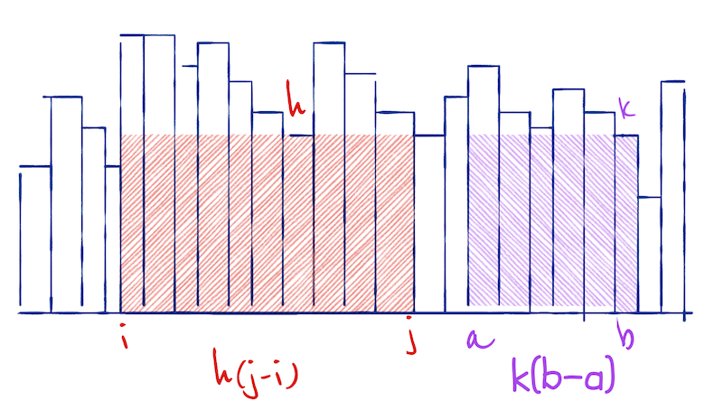
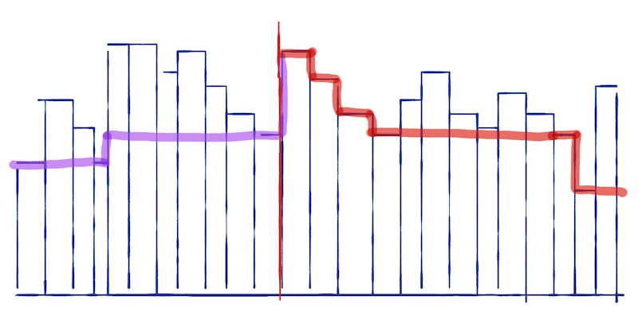
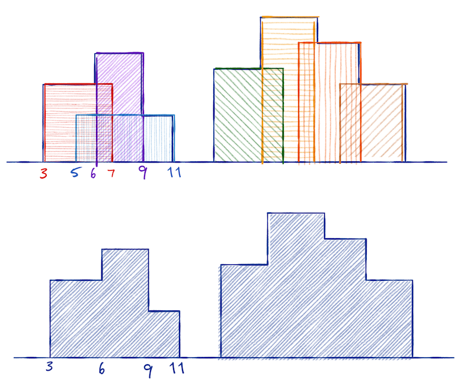

# Divide and conquer

## Missing element

You are given a sorted array, `A`. It contains n - 1 of the numbers from 1 to n. You should find the missing number.

You can use the property that for all numbers `i` less than the missing number you have `A[i] == i`, while for all `i` larger than the missing number you have `A[i] == i - 1`.

Design an algorithm to solve the problem and derive its running time.

## Fast multiplication

It is fast to add numbers on a computer, but multiplication can be slow. The simple way to multiply two numbers, a × b, is to iteratively add, e.g.

```python
res = 1
for i in range(a):
	res += b
```

If you pick the smallest of the two numbers for the range, the complexity is O(min(alb)).

Multiplying and dividing by two is a fast operation. It is just shifting bits. If you exploit the equations

```
	a × b = (a / 2) × 2b when a is even
	a × b = (a / 2) × 2b + b when a is odd
```

can you derive an algorithm that multilines two numbers in O(log(min(a,b))).

## Largest area under a histogram

Consider a histogram with splits at integers 0 to n. You want to find the largest-area rectangle in it. 



The area for the interval i to j is h(j-q) where h is the shortest block in the histogram between i and j. You can find the largest rectangle by going through all pairs (i,j), find the shortest block, and compute the area. Then pick the pair with the largest area. A naive implementation of this would take O(n³). (Why?)

You can construct a divide-and-conquer algorithm for solving it by observing that, the largest rectangle contained in the interval i to j (not the one that goes from i to j but the largest inside it) is found in the first half, the last half, or starting before and ending after the midpoint.

To make the algorithm efficient, you should also observe that you can compute the largest area that cuts through an index m as follows: Compute an array that, for i < m, contains the minimal height between i and m, and that for j > m, contains the minimal height between m and j.



If you extend the rectangle around m by moving i from m down to zero and j from m up to n, and you always extend in the direction with the largest height, you can compute the largest area that spans over m in linear time.

Construct an algorithm for solving this problem and derive its running time.

## Skylines

You are given a list of (2D) houses, represented as triplets `(i,h,j)` where `i` and `j` are the start and end coordinates and `h` is the height. This list is not sorted.

You should compute the skyline of these houses, i.e. a representation of the height of the tallest house at each index `i`. You shouldn’t represent the skyline like this, but as triplets, `(i,h,j)`, where `i` and `j` are points where the height of the tallest house changes and `h` is the height in the range `i` to `j`.



Observe the following: 

1. The skyline for a single house, `(i,h,j)`, is simply the list `(0,0,i); (i,h,j); (j,0,n)`. 
2. If you have two skylines, you can merge them in linear time.

Prove item 2. and use it to derive an O(n log n) divide-and-conquer algorithm for computing skyline plots.


