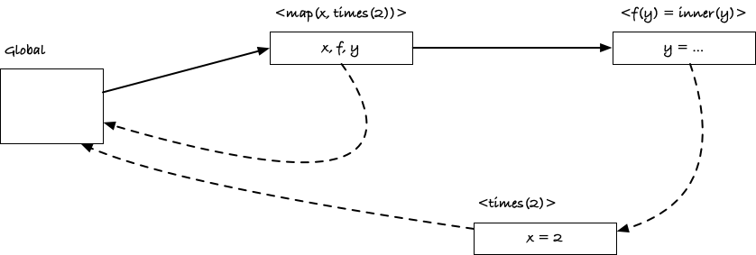
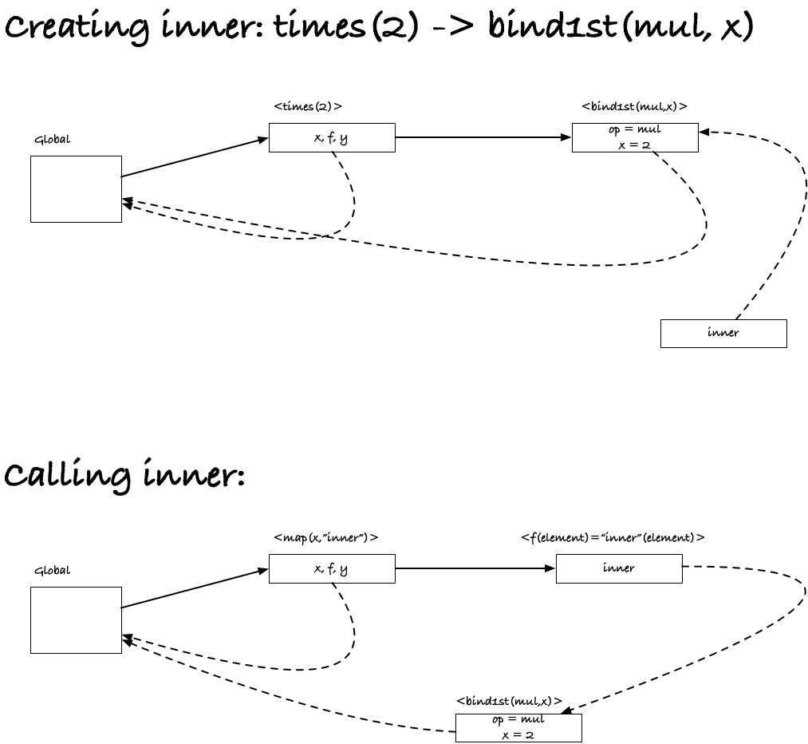
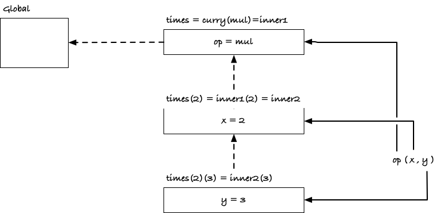
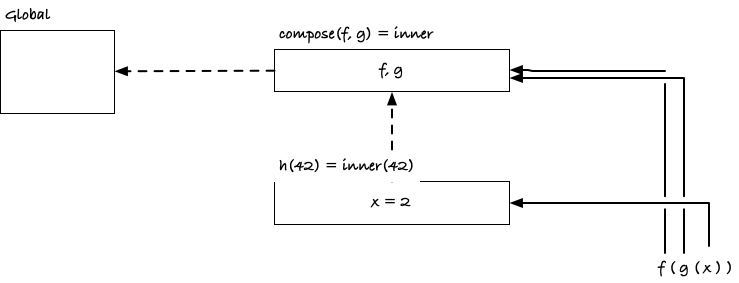

## Mapping functions

Consider the code:

```python
def times(x):
	def inner(y):
		return x * y
	return inner

def minus(x):
	def inner(y):
		return y - x
	return inner

times_two = times(2)
minus_13 = minus(13)
```

The `times()` and `minus()` functions take one parameter, the factor you should multiply with and the number you should subtract, and return functions that do that. Here, I defined `times_two()` and `minus_13()` using them, but of course, we don’t have to create these two functions to apply them, because we could also just do

```python
def map(x, f):
	return [f(y) for y in x]

map(x, times(2))
map(x, minus(13))
```

**Exercise:** What are the scopes when we call `map()`?

For `map(x, times(2))` the `map()` call has three local variables, `x`, `f`, and `y`, where `f` refers to the result we got from `times(2)`. That `times(2)` result is a function created in the scope of the `times(2)` instance, so when we call it, it executes in an environment that refers to that. In this figure:



the `<f(y)=inner(y)>` refers to the call of the inner function, so it is the instance that has the local variable `y`. Its "parent environment" is the function instance `<times(2)>` where it can find the value for `x`.

The situation for `map(x, minus(13))` is similar.

**Exercise:** Write a function for addition and division.

```python
def add(x):
	def inner(y):
		return x + y
	return inner

def div(x):
	def inner(y):
		return y / x
	return inner
```

## Binding parameters

Now define

```python
def bind1st(op, x):
	def inner(y):
		return op(x, y)
	return inner
```

and run

```python
def times(x):
	return bind1st(mul, x)
map(x, times(2))
```

**Exercise:** Work out which functions are called when you do the `map()`, and what their enclosing environments are.

Consider:



Before we call `map()` we must evaluate its arguments, so the first step is to evaluate `times(2)`. That gives us an instance of the `times()` function, and from that instance we call `bind1st()`. This is not an inner function so `<bind1st(mul,x)>`'s parent environment is the global environment. However, the `bind1st()` call binds the variables `op` and `x` and returns an inner function. That inner function lives in the `bind1st()` instance, so if we invoke it later, it will have the `<bind1st(mul,x)>` instances as its parent.

This happens when we call `map()`. There, the function `f` is the `inner` function from before. When w call it, we create a function instance of the `inner` function, and it will evaluate with its local variables and the parent environment that is `<bind1st(mul,x)`.

**Exercise:** Write a function `bind2nd()` that binds the second argument of a function. You should be able to use it in a call like this: `map(x, bind2nd(sub, 13))`.

```python
def bind2nd(op, y):
	def inner(x):
		return op(x, y)
	return inner
```

## Currying

This function transforms a function with two arguments into one that gets the first parameter and then produce a new function that, when you give it a parameter, evaluates the original function.

```python
def curry(op):
	def inner1(x):
		def inner2(y):
			return op(x, y)
		return inner2
	return inner1
```

Functions that you evaluate by a series of applications, with one argument at a time, are called *curried*, thus the name.

We have three functions in play her, `curry()` that gets the operator and returns the first function, `inner1()`. In the instance of the call to `curry()`, we have the variable `op`, so when we call `inner1()`, it can find it in its enclosing scope. When we call `inner1()`, we get a function instance that knows the local variable `x`, so the function that `inner1()` returns, `inner2()`, can get it from its enclosing scope (and get `op` from its enclosing scope’s enclosing scope). When we then call `inner2()`, we have the final parameter, `y`, in its local scope, it can get the other two parameters from the enclosing scope chain, so it can compute the final value.

Using `curry()`, we can define `times()` like this:

```python
times = curry(mul)
```

**Exercise:** What happens if you evaluate `curry(mul)(2)(3)`? Explain why.

Calling `curry(mul)` gives us the function

```python
def inner1(x):
	def inner2(y):
		return mul(x, y)
	return inner2
```

Just substitute `op` for `mul` in the function definition and extract the function `inner1` that `curry` returns. Calling that function with 2 gives us

```python
def inner2(y):
	return mul(2, y)
```

Again, simply substitute `x` for 3 and get the inner function. Calling this with 3 gives us `mul(2,3)`, which is 6.

**Exercise:** Work your way through a call to `times()`, to get all the functions that are called, and their enclosing environments.

I will not include the functions `mul` and `curry` in the figure; they sit as global variables. When we create `times` we create an instance of `curry(mul)` which binds the parameter `op` to the `mul` function. The result is a function, `inner1`, that lives in this environment. When we call `times(2)` we create an instance of this `inner1` function where we bind `x` to 2. The result is another function that sits in this environment. Then, a call `times(2)(3)` will create yet a third environment where we have bound `y` to 3, and in this environment we evaluate `op(x, y)`. We have immediate access to `y` because we evaluate the expression in the environment that holds the variable. The variable `x` we get from the parent environment. For `op`, we have to go two environments up to find that it is bound to `mul`.



**Exercise:** Going the opposite direction, taking a chain of function calls and going back to one that takes all the arguments at once, us called *uncurrying*. Write a function take takes a curried function such as `times()` and translate it into one that takes two parameters and evaluate the chain of function calls in the curried function.

```python
def uncurry(f):
    def u(x, y):
        return f(x)(y)
    return u
```

## Function composition

**Exercise:** Work out what this code does, what chain of function calls are involved when you use it, and how the scopes are connected.

```python
def compose(f, g):
	def inner(x):
		return f(g(x))
	return inner

def f(x): return 3 * x
def g(x): return x - 2
h = compose(f, g)
h(42)
```

This one is simpler than the `curry/time` case. We have an `inner` function from `compose()` that holds `f` and `g`, and when we call `h(42)` we bind `x`.



